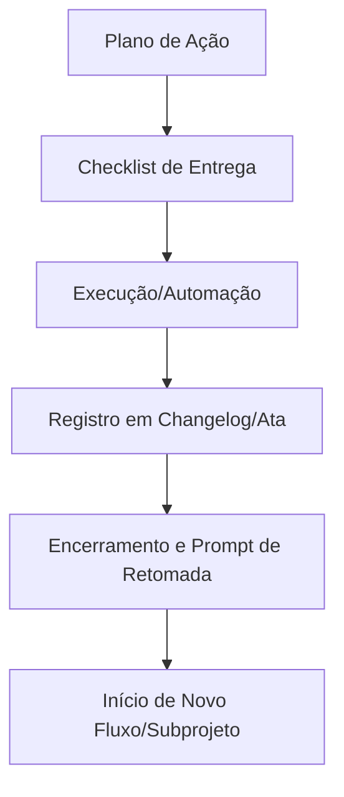

# Manifesto Consolidado — ScarecrowLab

## 1. Objetivo do Manifesto

Este manifesto serve como referência única, autoexplicativa e operacional para todos os agentes do ScarecrowLab (MCP, GHC, GPT-4.1, GPT-5, Mini). Ele consolida protocolos, templates, comandos, fluxos e diretrizes essenciais para garantir rastreabilidade, automação e integração entre agentes, sem depender de links externos.

## 2. Visão Geral

O ScarecrowLab é um laboratório de automação, integração e governança de agentes de IA, focado em modularidade, rastreabilidade e colaboração entre múltiplos modelos. Toda a documentação, templates e fluxos são centralizados neste manifesto para garantir consistência e fácil consulta.

## 3. Princípios Centrais

- Modularização e separação de subprojetos
- Rastreabilidade total de decisões, entregas e debates
- Automação de fluxos e validação por checklists
- Integração transparente entre agentes (MCP, GHC, GPT-5, etc.)
- Uso de templates e comandos padronizados
- Documentação autoexplicativa e sem dependências externas

## 4. Fluxograma Operacional



---

## 5. Integração MCP — Orientações e Migração

O manifesto consolidado substitui o processo antigo de arquivo-resumo e deve ser consultado pelo MCP para visão geral do projeto. O fluxo operacional, decisões e rastreabilidade devem ser sempre baseados no arcabouço principal (`copilot-instructions.md` e anexos).

## 6. Como Funciona

- O arcabouço principal está em `.github/copilot-instructions.md` e anexos.
- Subprojetos organizados em `python_apps/`, `extensoes/`, etc.
- Checklists, atas, changelogs e templates centralizados por subprojeto.
- O manifesto é atualizado sempre que o arcabouço for revisado.

## 7. Protocolo de Conversa Orquestrada

- MCP prepara prompts e sumários baseados no conteúdo da page.
- GHC recebe prompts via chat, aplica alterações no manifesto/arquivos auxiliares, registra changelog/ata.
- Orquestrador valida e aprova mudanças.
- Ciclo reinicia a cada atualização relevante.

**Comandos padrão:**
```
@copilot: ler <arquivo>.md
@copilot: escrever <arquivo>.md
```

**Exemplo de conversa simulada:**
```
@copilot: ler planoacaointegracao.md
- Validar ambiente virtual
- Executar testes automatizados
- Atualizar changelog
@modeloB: escrever planoacaointegracao.md
@copilot: modeloB, sugiro incluir “Verificar dependências” antes da validação.
@modeloB: Etapa adicionada. Checklist atualizado. Changelog registrado.
```

---

## 8. Templates Essenciais (exemplos)

### Template de Ata
```
# Ata de Debate — ScarecrowLab
- Data/hora: 2025-10-08
- Participantes: Flavio, GitHub Copilot
- Tema: Revisão de diretrizes
- Pontos debatidos: ...
- Decisões: ...
- Observações: ...
```

### Template de Plano de Ação
```
# Plano de Ação — ScarecrowLab
**Objetivo:** (Descreva o objetivo principal)
**Contexto:** (Explique o contexto, motivação e dependências)
## Etapas Previstas
- [ ] (Descreva cada etapa)
- [ ]
**Critérios de sucesso:** (Liste critérios claros)
**Justificativa de persistência:** (Explique se o plano será temporário ou persistente)
```

### Template de Checklist de Entrega
```
# Checklist de Entrega — ScarecrowLab
**Vinculado ao plano de ação:** (Referencie o plano de ação)
## Etapas de Entrega
- [ ] (Descreva cada etapa)
- [ ]
**Status final:** (Concluído, pendente, cancelado)
**Justificativa de persistência:** (Explique se o checklist será temporário ou persistente)
**Observações:** (Aprendizados, recomendações, links)
```

### Template de Checklist
```
# Checklist — ScarecrowLab
**Objetivo:** (Descreva o objetivo, contexto e motivação)
## Instruções de Execução
... (orientações, pré-requisitos)
## Etapas
- [ ] (Descreva cada etapa)
- [ ]
## Links Relacionados
- (Atas, debates, changelog, etc.)
```

### Template de Changelog
```
# Changelog — ScarecrowLab
- Data/hora: 2025-10-08
- Responsável: GitHub Copilot
- Descrição: Checklist X concluído
- Status final: concluído
- Link para checklist/ata: ./checklist_X.md
```

---

## 9. Diretrizes para Versionamento de Arquivos Markdown
- Nomear arquivos de acordo com o tema e data, ex: `ata_debate_2025-10-08.md`.
- Manter templates e exemplos embutidos neste manifesto.
- Atualizar changelog ao encerrar temas/checklists (exceto manifesto).
- Não depender do histórico Git para rastreabilidade: use checklists e changelogs.

---

## 10. Exemplo de Conversa entre IAs
```
@copilot: ler conversa_modeloA_modeloB.md
@modeloB: escrever conversa_modeloA_modeloB.md
```

---

## 11. Glossário Essencial
- **Ata:** Registro formal de decisões, debates ou reuniões.
- **Changelog:** Histórico de alterações, encerramentos e decisões.
- **Checklist de entrega:** Lista de etapas executadas em uma entrega.
- **Checklist temporário:** Lista criada para controle pontual, não rastreada formalmente.
- **Manifesto:** Documento central de diretrizes do laboratório.
- **MCP:** Microsoft Copilot (VS Code, Windows, 365, etc.)
- **GHC:** GitHub Copilot Agent.
- **Plano de ação:** Sequência de etapas para atingir um objetivo.
- **Prompt de retomada:** Mensagem com contexto, status e próximos passos.
- **Subprojeto:** Pasta dedicada a uma iniciativa específica.
- **Tema:** Assunto central de uma pendência, debate ou checklist.

---

## 12. Bloco de Validação — Compatibilidade de Agentes

**Objetivo:** Garantir que este manifesto seja corretamente interpretado e utilizado por agentes baseados em MCP, GHC, GPT-4.1, GPT-5 e Mini.

### Checklist de Validação
- [ ] O arquivo contém todos os templates essenciais (ata, plano de ação, checklist, changelog) visíveis e com exemplos práticos.
- [ ] Não há dependência de links externos; todo conteúdo referenciado está embutido.
- [ ] O protocolo de conversa orquestrada (MCP <-> GHC) está descrito com exemplos simulados.
- [ ] O glossário está completo e autoexplicativo.
- [ ] O fluxograma operacional está presente e compreensível.
- [ ] O manifesto pode ser lido e seguido integralmente por agentes sem instruções adicionais.
- [ ] Teste: Peça a um agente GPT-5 Mini para listar 3 comandos padrão e 2 templates do manifesto.
- [ ] Teste: Peça ao MCP para simular uma rodada de atualização usando apenas este arquivo.
- [ ] Teste: Peça ao GHC para gerar um checklist de entrega a partir do template embutido.

**Instrução:**
Antes de considerar o manifesto como referência padrão, execute os testes acima com cada agente-alvo e registre eventuais ajustes necessários diretamente neste arquivo.

---

## 13. Como Agentes de IA Atuam no ScarecrowLab

- Agentes devem seguir o arcabouço e este manifesto para garantir rastreabilidade e padronização.
- Toda execução deve ser registrada em changelog, checklist ou ata, conforme o fluxo do projeto.
- O manifesto é referência geral; decisões e execuções devem ser baseadas no arcabouço principal.

---

## 14. Resumo

O ScarecrowLab prioriza modularidade, rastreabilidade, automação e integração transparente entre agentes. O manifesto consolidado serve como visão geral e referência para MCP e agentes externos, mas o fluxo operacional e decisões devem ser sempre baseados no arcabouço principal e seus anexos.

---

**Fim do manifesto consolidado — ScarecrowLab**
