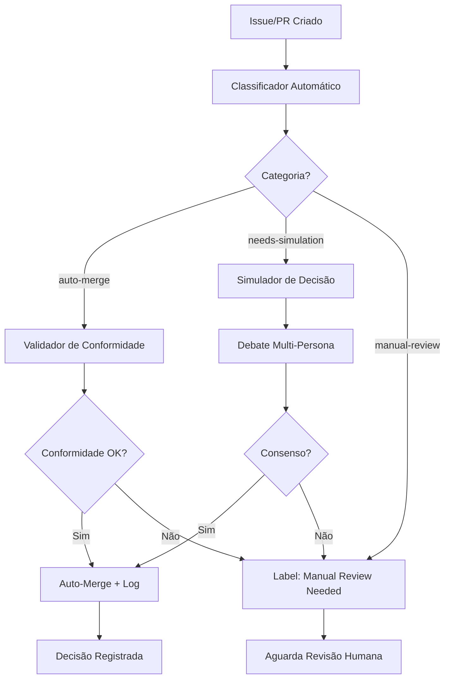

# Scarecrow AutoFlow — Sistema de Aprovação Automatizada

## Sumário Executivo

Este subprojeto implementa um sistema modular para classificação, validação e aprovação automatizada de issues e pull requests no ScarecrowLab. O objetivo é reduzir drasticamente a necessidade de aprovação manual, mantendo rastreabilidade total, segurança e aderência aos fluxos e artefatos constitucionais do laboratório.

## Proposta Vigente

### Objetivos Principais

1. **Classificação Automatizada:** Categorizar automaticamente issues e PRs em auto-merge, needs-simulation ou manual-review
2. **Validação por Artefatos:** Verificar conformidade com manifesto, templates, checklists e logs operacionais
3. **Simulação de Decisão:** Para casos médios, simular deliberação entre personas especializadas do lab
4. **Aprovação Automatizada:** Auto-merge com rastreabilidade completa quando critérios forem atendidos
5. **Monitoramento e Evolução:** Painel de governança com métricas de eficiência e ajuste contínuo

### Escopo

**Incluído:**
- Classificador automático de issues/PRs baseado em metadados e conteúdo
- Validador de conformidade com artefatos constitucionais (manifesto, templates, diretrizes)
- Simulador de decisão usando personas do laboratório
- Sistema de logs versionados em `/decisoes_automatizadas/`
- GitHub Actions workflows para automação completa
- Labels automáticos para rastreabilidade
- Painel de governança com métricas (opcional)

**Não incluído (fora de escopo):**
- Alteração de artefatos constitucionais do laboratório
- Automação de tarefas internas não relacionadas a aprovações (coberto por `automacao_tarefas_lab`)
- Orquestração genérica de issues (coberto por `orquestracao_issues_api`)

### Justificativa

Conforme issue #XX, o laboratório enfrenta gargalo crítico de aprovação manual de issues e PRs. Este sistema visa:
- Reduzir tempo de aprovação em até 80% para casos simples
- Garantir rastreabilidade total de todas as decisões automatizadas
- Manter conformidade rigorosa com governança do laboratório
- Permitir evolução contínua baseada em métricas reais

### Categorias de Classificação

**1. auto-merge** 
- Requisitos claramente atendidos
- Conformidade total com artefatos constitucionais
- Sem risco identificado
- Exemplos: atualização de documentação simples, correção de typos, atualização de dependências sem breaking changes

**2. needs-simulation**
- Requisitos parcialmente atendidos
- Necessita validação de múltiplos critérios
- Beneficia-se de análise multi-perspectiva
- Exemplos: novos subprojetos, mudanças em diretrizes, alterações em templates

**3. manual-review**
- Requisitos complexos ou conflitantes
- Mudanças de alto impacto
- Alterações em artefatos críticos
- Exemplos: mudanças no manifesto consolidado, alterações em fluxos centrais, decisões estratégicas

### Personas Simuladas

**Engenheiro de Prompt**
- Foco: clareza, efetividade e manutenibilidade das instruções
- Valida: templates, prompts, diretrizes de comunicação

**Guardião do Manifesto**
- Foco: conformidade constitucional e rastreabilidade
- Valida: aderência ao manifesto, glossário, princípios centrais

**DevOps Modular**
- Foco: automação, modularidade e integração
- Valida: scripts, workflows, integrações entre subprojetos

## Histórico de Debates e Atas

- [ATA_ABERTURA](debates/ATA_ABERTURA.md) — Criação do subprojeto e definição de escopo inicial

## Checklists

- [Checklist Principal](CHECKLIST.md) — Roadmap e tarefas do subprojeto

## Documentação Técnica

- [Critérios de Classificação](docs/CRITERIOS_CLASSIFICACAO.md) — Regras detalhadas para classificação automática
- [Regras de Validação](docs/REGRAS_VALIDACAO.md) — Critérios de conformidade com artefatos
- [Processo de Simulação](docs/PROCESSO_SIMULACAO.md) — Funcionamento da simulação de decisões
- [Guia de Uso](docs/GUIA_USO.md) — Como usar o sistema (para contribuidores)

## Estrutura do Subprojeto

```
scarecrow_autoflow/
├── README.md                    # Este arquivo
├── CHECKLIST.md                 # Checklist principal
├── CHANGELOG.md                 # Histórico de alterações
├── debates/                     # Atas e discussões
│   └── ATA_ABERTURA.md
├── checklists/                  # Checklists específicos
├── docs/                        # Documentação técnica
│   ├── CRITERIOS_CLASSIFICACAO.md
│   ├── REGRAS_VALIDACAO.md
│   ├── PROCESSO_SIMULACAO.md
│   └── GUIA_USO.md
├── scripts/                     # Scripts de automação
│   ├── classificador.py
│   ├── validador.py
│   └── simulador.py
└── decisoes_automatizadas/      # Logs de decisões automatizadas
    └── README.md
```

## Referências ao Arcabouço

### Diretrizes

- [Diretrizes para Subprojetos](../.github/copilot-diretrizes/diretrizes_subprojetos.md)
- [Glossário](../.github/copilot-diretrizes/glossario.md)
- [Fluxos Gerais para Agentes](../.github/copilot-diretrizes/fluxos_gerais_agentes.md)
- [Protocolo de Orquestração via Chat](../.github/copilot-diretrizes/protocolo_orquestracao_chat.md)

### Templates Utilizados

- [Template de Subprojeto](../.github/TEMPLATE_SUBPROJETO.md)
- [Template de Checklist](../.github/TEMPLATE_CHECKLIST.md)
- [Template de Ata](../.github/copilot-diretrizes/TEMPLATE_ATA.md)

### Rastreabilidade

- [Painel Central de Subprojetos](../.github/painel_subprojetos.md): Fonte única de status e pendências

## Integração com Outros Subprojetos

- **automacao_tarefas_lab:** Fornece infraestrutura base de automação
- **orquestracao_issues_api:** Fornece framework de orquestração de issues
- **framework_diretrizes_ia:** Fornece diretrizes normativas para validação
- **mapa_papeis_responsabilidades_ia:** Define personas e roles para simulação

## Fluxo Operacional



## Métricas de Sucesso

- **Taxa de Automação:** % de issues/PRs aprovados automaticamente
- **Tempo Médio de Aprovação:** Redução em relação ao processo manual
- **Taxa de Conformidade:** % de decisões automatizadas sem reversão
- **Cobertura de Classificação:** % de issues/PRs classificados corretamente

---

> Siga as diretrizes do repositório e utilize o painel central de subprojetos para rastreabilidade total.
